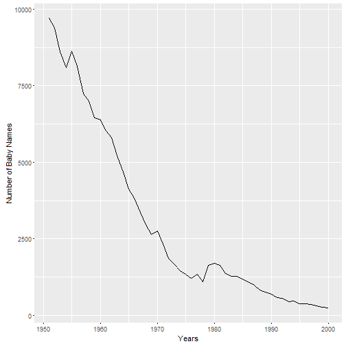

Developing Data Products
========================================================
author: Nazmi Anik
date: 09/17/2016
autosize: true

### Coursera Course Project

Developing Data Products
========================================================
  
This presentation is part of the Developing Data Products course from Coursera.  
  
There are two purposes:

- Creating a reactive shiny app (linked [here](https://finishim.shinyapps.io/BabyNamesPopularity/))
- Creating a reproducible pitch presentation using Rstudio Presenter or Slidify

Baby Name Popularity
========================================================
  
The purpose of the Baby Name Popularity app is to look at the usage trend of a given name
with a specified gender and within user-selected range of years.  
Below is how the dataframe was formed from the data on [data.gov](https://catalog.data.gov/dataset/baby-names-from-social-security-card-applications-national-level-data):  

```r
if (!file.exists(".\\data\\names")) {
    tmp <- tempfile(fileext = ".zip")
    url <- "https://www.ssa.gov/oact/babynames/names.zip"
    download.file(url, tmp, quiet = TRUE)
    unzip(tmp, exdir = ".\\data\\names")
    unlink(tmp)
    }
all <- dir(".\\data\\names", "\\.txt$", full.names = TRUE)
year <- as.numeric(gsub("[^0-9]", "", basename(all))) 
data <- lapply(all, read.csv, header=F, stringsAsFactors = F) 
one <- do.call(rbind,data) 
names(one) <- c("name", "sex", "n")
one$year <- rep(year, vapply(data, nrow, integer(1))) 
```

Baby Name Popularity
========================================================

Here is the structure of this dataframe:  

```
'data.frame':	1858689 obs. of  4 variables:
 $ name: chr  "Mary" "Anna" "Emma" "Elizabeth" ...
 $ sex : chr  "F" "F" "F" "F" ...
 $ n   : int  7065 2604 2003 1939 1746 1578 1472 1414 1320 1288 ...
 $ year: num  1880 1880 1880 1880 1880 1880 1880 1880 1880 1880 ...
```

Baby Name Popularity
========================================================
  
As an example, let's run this with a female name "Bonnie" between the years 1950-2000:  

